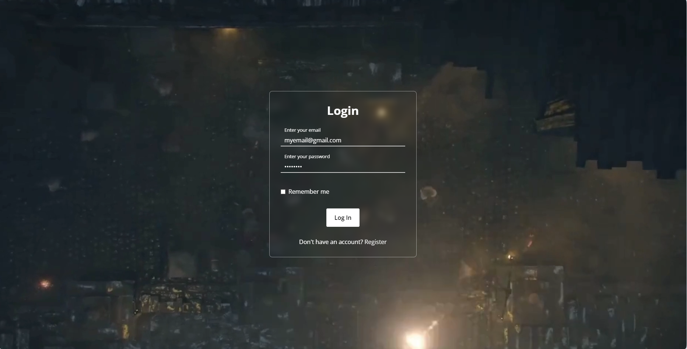
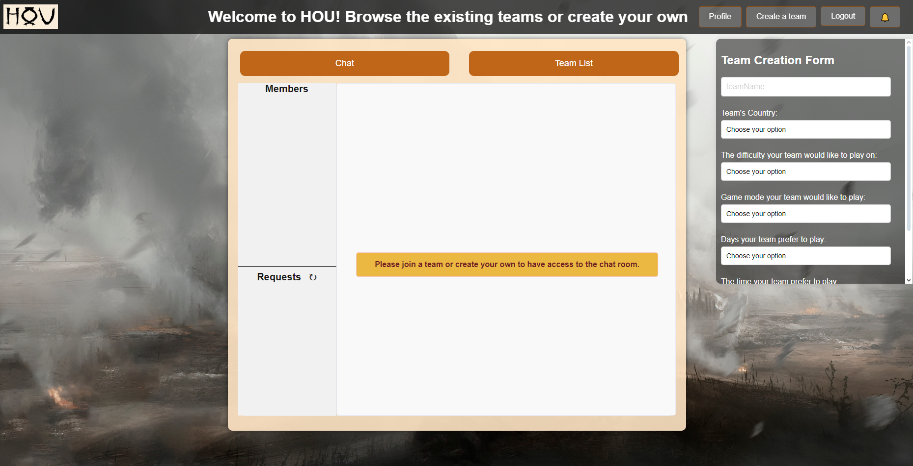
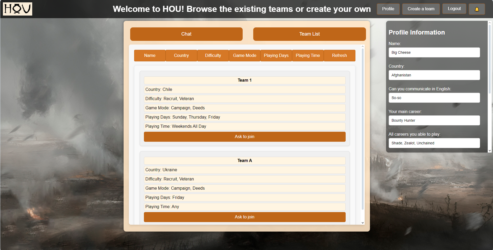
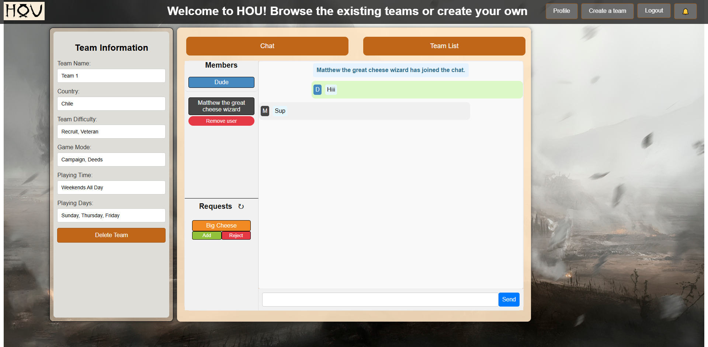

# HOU, Mate Finder App for Vermintide 2.

HOU is an app designed to help players find teammates for Vermintide 2. It helps you connect with others, join or form teams, and manage game sessions.

Features:

Profile Creation: Add your class, country, skills, etc.

Create a team: Create your team with your preferred mode and style of play and specify 

which players you are looking for.

Find Teams: Browse and join teams that match your playstyle.

Join Teams: Apply to teams you're interested in.

Team Management: Accept or reject team applications.

Chat: Communicate with your team in a dedicated chat.

Admin Controls: Add or remove members from your team.

## The app does not adapt well to phones and small screens.

## Screenshots

## Login Page

## Registration page

## Main Page

## Team List

## Team Chat

# Technologies Used in the Project

This project utilizes the following technologies:

## Core Technologies
- **Java 17**: Programming language.
- **Spring Boot 3.3.4**: Framework for building web applications.
- **PostgreSQL**: Relational database.

## Dependencies
1. **Spring Boot Starter Web**  
   - For creating REST APIs and web applications.

2. **Spring Boot Starter Thymeleaf**  
   - For working with HTML templates.

3. **Spring Boot Starter Data JPA**  
   - For database interactions using JPA (Hibernate).

4. **Spring Boot Starter Security**  
   - For implementing authentication and authorization.

5. **Spring Boot Starter Validation**  
   - For validating input data.

6. **Spring Boot Starter Websocket**  
   - For real-time bidirectional communication via WebSocket.

7. **Thymeleaf Extras Spring Security 6**  
   - For integrating Spring Security features into Thymeleaf templates.

8. **PostgreSQL JDBC Driver**  
   - For connecting to the PostgreSQL database.

## Tools and Build
- **Maven**: Dependency and build management tool.
- **Spring Boot Maven Plugin**: Simplifies building and running Spring Boot applications.
